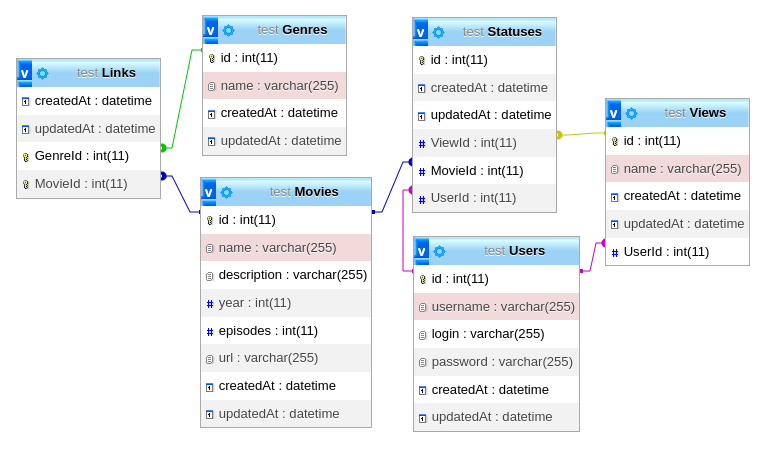

# ANIME

## web app information page of watched movies

[авторизация] (#auth-id)

## добавление фильмов {#add-movie} 

structure database

* meta
* link
* header
    * logo

[Авторизация] (#auth-id)